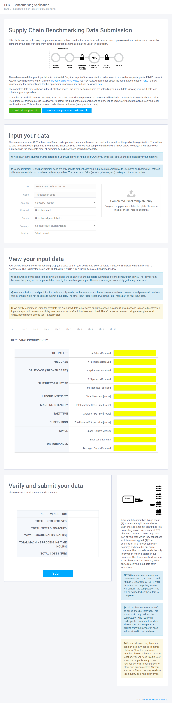

# petronia-mpc-mock-up
This repository contains resources part of master thesis research conducted by M. Petronia at Delft Technical University.

## Features

- Django 3.6+
- Uses [Pipenv](https://github.com/kennethreitz/pipenv) - the officially recommended Python packaging tool from Python.org.
- Development, Staging and Production settings with [django-configurations](https://django-configurations.readthedocs.org).
- Get value insight and debug information while on Development with [django-debug-toolbar](https://django-debug-toolbar.readthedocs.org).
- Collection of custom extensions with [django-extensions](http://django-extensions.readthedocs.org).
- HTTPS and other security related settings on Staging and Production.
- Procfile for running gunicorn with New Relic's Python agent.
- PostgreSQL database support with psycopg2 (provision).

## How to install

- Clone repository
- Create and activate virtual environement 
- Install prerequisites:

```bash
$ pip install -r requirements/local.txt
```

- Include stylesheets (CSS, JS, etc). Request access via masud.petronia@gmail.com
- Run application:

```bash
$ python manage.py runserver
```

## Environment variables

These are common between environments. The `ENVIRONMENT` variable loads the correct settings, possible values are: `DEVELOPMENT`, `STAGING`, `PRODUCTION`.

```
ENVIRONMENT='DEVELOPMENT'
DJANGO_SECRET_KEY='dont-tell-eve'
DJANGO_DEBUG='yes'
```

These settings(and their default values) are only used on staging and production environments.

```
DJANGO_SESSION_COOKIE_SECURE='yes'
DJANGO_SECURE_BROWSER_XSS_FILTER='yes'
DJANGO_SECURE_CONTENT_TYPE_NOSNIFF='yes'
DJANGO_SECURE_HSTS_INCLUDE_SUBDOMAINS='yes'
DJANGO_SECURE_HSTS_SECONDS=31536000
DJANGO_SECURE_REDIRECT_EXEMPT=''
DJANGO_SECURE_SSL_HOST=''
DJANGO_SECURE_SSL_REDIRECT='yes'
DJANGO_SECURE_PROXY_SSL_HEADER='HTTP_X_FORWARDED_PROTO,https'
```

Production variables. Also include in Heroku.

```
DJANGO_ADMIN_URL 'enter URL'
DJANGO_ALLOWED_HOSTS = 'heroku app name'
DJANGO_AWS_ACCESS_KEY_ID = 'Amazon AWS S3 bucket access ID'
DJANGO_AWS_SECRET_ACCESS_KEY = 'Amazon AWS S3 bucket access key'
DJANGO_AWS_STORAGE_BUCKET_NAME = 'Amazon AWS S3 bucket name'
DJANGO_DEBUG = 'False'
DJANGO_SECRET_KEY = 'Django secret key'
DJANGO_SETTINGS_MODULE config.settings.production
HEROKU_POSTGRESQL_GRAY_URL = 'Heroku PostgresSQL url'
PYTHONHASHSEED = 'random'
REDIS_URL = 'redis://redis:6379/0'
WEB_CONCURRENCY = '4'
```

## Deployment

It is possible to deploy to Heroku or to your own server.

### Heroku

```bash
$ heroku create
$ heroku addons:add heroku-postgresql:hobby-dev
$ heroku pg:promote DATABASE_URL
$ heroku config:set ENVIRONMENT=PRODUCTION
$ heroku config:set DJANGO_SECRET_KEY=`./manage.py generate_secret_key`
```
## Preview



## License

The MIT License (MIT)

Copyright (c) 2020 Masud Petronia

Permission is hereby granted, free of charge, to any person obtaining a copy of
this software and associated documentation files (the "Software"), to deal in
the Software without restriction, including without limitation the rights to
use, copy, modify, merge, publish, distribute, sublicense, and/or sell copies
of the Software, and to permit persons to whom the Software is furnished to do
so, subject to the following conditions:

The above copyright notice and this permission notice shall be included in all
copies or substantial portions of the Software.

THE SOFTWARE IS PROVIDED "AS IS", WITHOUT WARRANTY OF ANY KIND, EXPRESS OR
IMPLIED, INCLUDING BUT NOT LIMITED TO THE WARRANTIES OF MERCHANTABILITY,
FITNESS FOR A PARTICULAR PURPOSE AND NONINFRINGEMENT. IN NO EVENT SHALL THE
AUTHORS OR COPYRIGHT HOLDERS BE LIABLE FOR ANY CLAIM, DAMAGES OR OTHER
LIABILITY, WHETHER IN AN ACTION OF CONTRACT, TORT OR OTHERWISE, ARISING FROM,
OUT OF OR IN CONNECTION WITH THE SOFTWARE OR THE USE OR OTHER DEALINGS IN THE
SOFTWARE.

## Funding

The development of this mockup has received funding from the European Union’s Horizon 2020 Research and Innovation Programme, under Grant Agreement no 825225 – Safe Data Enabled Economic Development (SAFE-DEED), from the H2020-ICT-2018-2 Call. https://safe-deed.eu/
